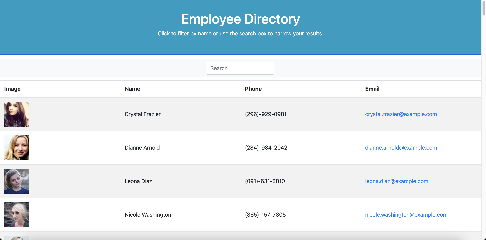

# React Homework: Employee Directory

Create an Employee Directory using React to have quick access to employee information.

## Deployment

Deployed to Github Pages

[Employee Directory](https://karizmatik215.github.io/Unit-19-React-Homework-Employee-Directory/)

## Screenshot

## License

[MIT](https://choosealicense.com/licenses/mit/)

## Author

- [@karizmatik215](https://www.github.com/karizmatik215)
